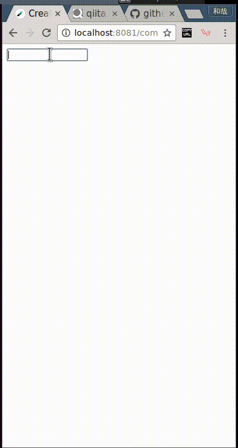

# vue-typeahead



http://qiita.com/acro5piano/items/13456f2c3d5ee64844c2

# Usage

```html
<template>
  <div>
    <typeahead :options="prefectures"></typeahead>
  </div>
</template>

<script>
  export default {
    components: {
      typeahead: require('./Typeahead.vue')
    },
    data () {
      return {
        prefectures: ['hokkaido', 'aomori', 'iwate', 'miyagi', 'akita', 'yamagata', 'fukushima', 'ibaraki', 'tochigi', 'gunma', 'saitama', 'chiba', 'tokyo', 'kanagawa', 'niigata', 'toyama', 'ishikawa', 'fukui', 'yamanashi', 'nagano', 'gifu', 'shizuoka', 'aichi', 'mie', 'shiga', 'kyoto', 'osaka', 'hyogo', 'nara', 'wakayama', 'tottori', 'shimane', 'okayama', 'hiroshima', 'yamaguchi', 'tokushima', 'kagawa', 'ehime', 'kochi', 'fukuoka', 'saga', 'nagasaki', 'kumamoto', 'oita', 'miyazaki', 'kagoshima', 'okinawa']
      }
    }
  }
</script>
```

## Build Setup

``` bash
# install dependencies
npm install

# serve with hot reload at localhost:8080
npm run dev

# build for production with minification
npm run build

# build for production and view the bundle analyzer report
npm run build --report

# run unit tests
npm run unit

# run e2e tests
npm run e2e

# run all tests
npm test
```

For detailed explanation on how things work, checkout the [guide](http://vuejs-templates.github.io/webpack/) and [docs for vue-loader](http://vuejs.github.io/vue-loader).
